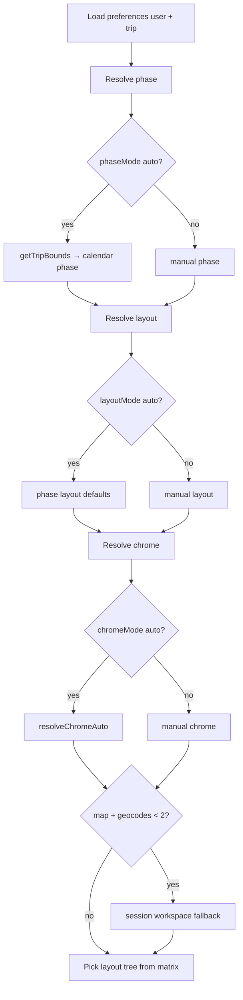

# Trip View Modes — Immersive Map-First & Plan vs Travel

Companion docs: [Planning Tools Ideas](./planning-tools-ideas.md), [Proactive Travel Assistant Plan](./proactive-travel-assistant-plan.md), [Trip Health & Collaborative Decisions Plan](./trip-health-and-decisions-plan.md).

This doc captures the **unified vision** for combining three product directions:

1. **Map-first interface** — map as the primary canvas (optional toggle)
2. **Plan vs Travel vs Wrap-up** — distinct modes with auto-switch by trip dates
3. **Zero-chrome immersive UI** — full-viewport travel experience with glass panels and gestures

It also includes a **visual polish backlog** from the trip details / expenses audit and a catalog of **other radical ideas** for future consideration.

---

## North star

> **Before the trip:** a structured planning workspace. **During the trip:** an immersive travel companion on a map. **After:** a calm wrap-up for money and memories.

The same trip data powers all modes. Users choose overrides; the app suggests smart defaults from calendar position.

---

## Scope (locked)

| In scope | Out of scope (v1) |
|----------|-------------------|
| `/trips/:id` — `NewTripDetails` only | `/trips/:tripId/activity-log` (unchanged; old chrome) |
| Expenses **only** as **`money` trip panel** — **no standalone page** | Dream trips (`/trips/dream/:id`) |
| View preferences: **per trip** (+ global default), trip-scoped `localStorage` keys | Cross-device sync (future MongoDB profile) |
| All existing trip menu/panel items remain reachable in every mode | Trip list page layout changes |

**Expenses migration (locked):** Remove `/trips/:tripId/expenses` route and `ExpensesPage`. Short-lived redirect to `/trips/:id?panel=money` optional during rollout; end state is panel only. Menu links open `money` panel on `NewTripDetails`.

---

## Product decisions (locked)

| Decision | Choice |
|----------|--------|
| **Mode axes** | Three independent layers: Phase, Layout, Chrome |
| **Phase control** | Auto (default) + user-selectable Plan / Travel / Wrap-up |
| **Phase auto source** | Trip `startDate`/`endDate`; if missing, **event-derived bounds** via unified `getTripBounds()` |
| **Layout control** | Auto + user-selectable Workspace / Map-first |
| **Chrome control** | Auto + user-selectable Full / Minimal / **Immersive** (immersive is **not** Travel-only) |
| **Immersive chrome** | Zero chrome on **both mobile and desktop** — no app header, hero, or toolbar |
| **Map-first** | Optional; auto-suggests Map during Travel and Wrap-up |
| **Geocode fallback** | **Session-only** downgrade to workspace + banner (does not persist layout override) |
| **Time (v1)** | Device local timezone for “today” and phase boundaries |
| **Condensed timeline** | **Disabled in Travel** phase |
| **Permissions** | `canEdit` gates create gestures; viewers get all modes minus edit CTAs |
| **Wrap-up 30-day revert** | Auto **phase only** → Plan; **layout/chrome manual overrides preserved** (e.g. Map + Immersive stick) |
| **Travel preflight (24h before)** | **Deferred** post-v1 |
| **Persistence** | Trip-scoped `localStorage` (matches `dismissedTripInsights:${tripId}` pattern); global default key separate; sheet snap / map filter not persisted (v1) |
| **Panels** | Same menu items in all modes; **half or full sheet** by content density; phase emphasizes primary items |
| **Today (immersive)** | Dock **Today** → expand bottom sheet to **half** (merged `InTripAssistant` content) |
| **Wrap-up** | Map layout available; **Money panel** emphasized in dock, peek sheet, and proactive cards |
| **Map tiles** | **MapTiler** via Leaflet `TileLayer`; OSM fallback if key missing (dev only) |

---

## Map tiles — MapTiler (locked)

Replace default OpenStreetMap tiles in `TripMap.tsx` with **MapTiler**. Stays on **react-leaflet** — no Mapbox GL migration in v1.

### Why MapTiler

- Visually stronger than raw OSM with minimal code change
- OSM-derived data — existing geocodes and pins stay valid
- Custom styles later in MapTiler Cloud if we want brand colors

### Environment

```bash
# .env (client — same pattern as VITE_PEXELS_API_KEY)
VITE_MAPTILER_API_KEY=your_key_here
```

Never commit the key. Document in project README or env example when added.

### Phase-aware styles (default)

| Resolved phase | MapTiler style | Map ID (reference) |
|----------------|----------------|---------------------|
| Plan | **Streets** | `streets-v2` |
| Travel | **Outdoor** | `outdoor-v2` |
| Wrap-up | **Streets** (or Satellite toggle later) | `streets-v2` |

Styles passed into `TripMap` from `resolveTripViewMode()` / `TripViewShell` so the map aesthetic shifts with phase without user action.

Optional v2: user toggle **Map / Satellite** in map chrome (MapTiler `hybrid` or `satellite`).

### Implementation sketch

```ts
// src/config/mapTiles.ts
export function getMapTilerTileUrl(style: 'streets' | 'outdoor', apiKey: string) {
  const mapId = style === 'outdoor' ? 'outdoor-v2' : 'streets-v2';
  return `https://api.maptiler.com/maps/${mapId}/{z}/{x}/{y}.png?key=${apiKey}`;
}
```

```tsx
// TripMap.tsx — replace OSM TileLayer
const apiKey = import.meta.env.VITE_MAPTILER_API_KEY;
const tileStyle = phase === 'travel' ? 'outdoor' : 'streets';
const url = apiKey
  ? getMapTilerTileUrl(tileStyle, apiKey)
  : 'https://{s}.tile.openstreetmap.org/{z}/{x}/{y}.png'; // dev fallback

<TileLayer
  url={url}
  attribution='&copy; <a href="https://www.maptiler.com/copyright/">MapTiler</a> &copy; <a href="https://www.openstreetmap.org/copyright">OpenStreetMap</a> contributors'
/>
```

### Module

| File | Role |
|------|------|
| `src/config/mapTiles.ts` | Style IDs, URL builder, phase → style mapping |
| `TripMap.tsx` | Accept optional `tileStyle` or `phase` prop; render `TileLayer` |

### Attribution

MapTiler requires on-map attribution. In **immersive** mode, keep attribution in a subtle corner (dock area or map overlay) — do not hide.

### Tile failure fallback (TVM-3.9)

1. Retry MapTiler once  
2. Fall back to OSM tiles for session  
3. If both fail, static thumbnail + message  

### Licensing

- MapTiler [free tier](https://www.maptiler.com/cloud/pricing/) sufficient for development
- Confirm production plan against expected MAU / tile loads before launch
- Mapbox remains a future option if we need 3D or heavy routing — **not** in v1 scope

---

## Three-layer mode system

Modes compose; they are not a single enum.

```ts
type TripPhase = 'plan' | 'travel' | 'wrap-up';
type TripLayout = 'workspace' | 'map';
type ChromeLevel = 'full' | 'minimal' | 'immersive';

interface TripViewPreferences {
  phaseMode: 'auto' | TripPhase;
  layoutMode: 'auto' | TripLayout;
  chromeMode: 'auto' | ChromeLevel;
}

interface TripViewSettingsStorage {
  global: TripViewPreferences;
  trips: Record<string, Partial<TripViewPreferences>>;
}

// localStorage keys (match existing trip-scoped prefs, e.g. dismissedTripInsights:${tripId})
//   tripViewMode:global     — default preferences for all trips on this browser
//   tripViewMode:${tripId}  — per-trip overrides (partial TripViewPreferences)
//
// No userId suffix in v1: same pattern as dismissedTripInsights / dismissedTripContextCards.
// Per-browser isolation is sufficient; shared-browser collaborators share trip view prefs (acceptable v1).
```

---

## Phase resolution (locked)

### Calendar source

Use **`getTripBounds(trip)`** from `src/services/tripStatus.ts` (trip dates, else earliest/latest event). Refactor `getTripPhase()` in proactive context to use the same bounds in TVM-0.

### Calendar → phase mapping

| Bounds vs today | Resolved phase | UI notes |
|-----------------|----------------|----------|
| No bounds | `plan` | **Unscheduled** — persistent “Set trip dates” banner; Travel/Wrap-up segments enabled but auto stays Plan |
| Before start | `plan` | |
| Start … end (inclusive) | `travel` | |
| After end | `wrap-up` | After **30 days** post-end, auto phase reverts to `plan` (layout/chrome overrides preserved; manual Wrap-up still allowed) |

### Manual phase override

User may select any phase regardless of calendar. Manual selection persists per trip until user sets Phase back to **Auto**.

Preview example: Travel forced before start → Travel UI with plan-appropriate empty states; no blocking.

---

## Layout & chrome resolution (locked)

Applied after phase is resolved. User overrides win over auto.

### Layout auto defaults

| Phase | Layout (auto) |
|-------|---------------|
| Plan | Workspace |
| Travel | Map |
| Wrap-up | Map |

### Chrome auto defaults

```ts
function resolveChromeAuto(phase: TripPhase, layout: TripLayout): ChromeLevel {
  if (layout === 'map' && phase === 'travel') return 'immersive';
  if (layout === 'map') return 'minimal';
  if (phase === 'travel') return 'minimal';
  if (phase === 'wrap-up') return 'minimal';
  return 'full';
}
```

User may set **Immersive** in any phase (e.g. Plan + Map + Immersive for spatial planning without dock-heavy Travel UI).

### Geocode session fallback

When `layout` resolves to `map` but geocoded event count &lt; 2:

1. Downgrade to **workspace** for current session only
2. Show banner: *“Add locations to use map view”* + link to location review
3. Do **not** write layout override to preferences

---

## Full state matrix

Each cell describes the **layout tree** when phase + layout + chrome are fully resolved. Many cells share a tree (noted as “≈”).

| Phase | Layout | Chrome | Layout tree | Primary emphasis |
|-------|--------|--------|-------------|------------------|
| Plan | Workspace | Full | **WorkspaceFull** — hero, toolbar, timeline, sidebar | Add, health, decisions, import |
| Plan | Workspace | Minimal | ≈ Full minus app header; floating chip + slim bar | Same, denser |
| Plan | Workspace | Immersive | ≈ Minimal + no toolbar; dock/More for tools | Timeline + planning panels |
| Plan | Map | Full | **MapSplitDesktop** / **MapSheetMobile** — map + timeline sheet | Spatial planning |
| Plan | Map | Minimal | Map canvas + sheet; no app header | Compare pins, explore |
| Plan | Map | Immersive | Map + peek sheet + dock; zero chrome | Immersive spatial planning |
| Travel | Workspace | Full | **TravelWorkspace** — no hero; today-focus timeline; next-up card | Now / Next |
| Travel | Workspace | Minimal | ≈ Full minus app header | Now / Next |
| Travel | Workspace | Immersive | ≈ Minimal (immersive without map is rare; prefer map) | Now / Next |
| Travel | Map | Full | Map + sheet (never app header in practice for Travel) | Directions, today pins |
| Travel | Map | Minimal | Map + sheet + slim bar | Today, alerts |
| Travel | Map | Immersive | **ImmersiveTravel** — map + peek + dock | Signature in-trip UX |
| Wrap-up | Workspace | Full | **WrapUpWorkspace** — hero optional; money CTA prominent | Settle, export |
| Wrap-up | Workspace | Minimal | ≈ Wrap-up without app header | Settle, export |
| Wrap-up | Workspace | Immersive | ≈ Minimal + dock | Money-forward |
| Wrap-up | Map | Full | Map + sheet; expense peek | Trip recap on map |
| Wrap-up | Map | Minimal | Map + sheet; money in peek | Memory + settle |
| Wrap-up | Map | Immersive | Map + peek (balances) + dock (**Money** highlighted) | Settle, export |

**Session override row:** Any Map row → WorkspaceFull when geocode fallback active.

---

## Universal navigation & phase emphasis (locked)

All trip tools remain available in every mode. Nothing is removed from the menu — **emphasis** changes.

### Panel sheet sizing by content density

| Panel | Default sheet | Rationale |
|-------|---------------|-----------|
| `today` | Half (Travel immersive) / Full (Plan workspace) | Merged into bottom sheet in map layouts |
| `money` | Full | Dense tables, forms |
| `planning` | Full | Health issues + resolutions |
| `notifications` | Half | List + actions |
| `checklist` | Half | Medium list |
| `notes` | Full | Editor |
| `map` | — | **Focuses root map** when layout=map; opens map panel only when layout=workspace |

When `activePanel === 'map'` and root map is visible: panel action **pans/zooms root map** instead of opening duplicate map.

### Phase emphasis (dock, peek, proactive cards, menu order)

| Tool | Plan | Travel | Wrap-up |
|------|------|--------|---------|
| Timeline / itinerary | ●●● | ● | ● |
| Planning / health | ●●● | ● | ● |
| Today / Now-Next | ● | ●●● | ● |
| Map | ●● | ●●● | ●● |
| Money | ● | ● | ●●● |
| Import / AI | ●●● | ● | ● |
| Checklist | ●● | ●● | ●● |
| Notes | ●● | ● | ●●● |
| Notifications | ●● | ●●● | ●● |
| Export | ● | ● | ●●● |

● = prominence (dock icon, peek slot, proactive card, menu section order).

### Dock (immersive & minimal chrome)

**Travel:** `Map · Today · More`  
**Plan (immersive):** `Itinerary · Map · More`  
**Wrap-up (immersive):** `Map · Money · More`

**More** opens full menu sheet with all items (same set as current `TripDetailsToolbar` menu).

---

## Surface map: Today / Now / InTripAssistant (locked)

| Surface | Plan + workspace | Plan/Travel/Wrap-up + map | Travel immersive |
|---------|------------------|---------------------------|------------------|
| Now / Next summary | Timeline + proactive card | Peek sheet | Peek sheet + floating card |
| Full today detail | Panel `today` (`InTripAssistant`) | Sheet **half** or full snap | Dock **Today** → sheet **half** only |
| AI briefings | Inside `InTripAssistant` | Sheet half content | Sheet half content |
| Multi-day timeline | Main column / sheet full | Sheet full snap | Sheet full via swipe up |

**Implementation:** Extract shared **`TodayView`** from `InTripAssistant` used by panel, sheet half, and peek summary. Deprecate separate Travel-only duplicate UI.

---

## Layer stack (locked)

```
L0  Map and/or timeline canvas
L1  Bottom sheet (peek | half | full)
L2  Floating chip, next-up card, dock
L3  Trip panel sheets (planning, money, checklist, …)
L4  Modals (event form, import, decisions, location confirm)
L5  Toasts
```

**Rules:**

- L4 always tops L0–L3
- Opening L4 collapses sheet to **peek** (not closed)
- Opening L3 panel hides dock labels conflict — dock remains for dismiss
- Decision comparison + AI import: available in all modes via L3/L4; **emphasized in Plan**

---

## Responsive layout (locked)

Immersive = **zero chrome on all breakpoints** (no app header on desktop).

| Breakpoint | Map-first | Immersive |
|------------|-----------|-----------|
| **Mobile** (`< lg`) | Full-viewport map + bottom sheet + dock | Same |
| **Desktop** (`lg+`) | **Split:** map ~60% + timeline/sheet rail ~40% (no bottom sheet drag required) | Full-viewport map + **right rail** (Now/Next, peek content) + dock; no app header |

Plan + Workspace + Full keeps current hero + grid on desktop.

---

## Chrome levels

| Level | App header | Trip hero | Toolbar | Sidebar | Container padding |
|-------|------------|-----------|---------|---------|-------------------|
| **Full** | Yes | Yes | Yes | Yes (lg+) | Yes |
| **Minimal** | No | No — floating chip | Slim bar | No | No — `fixed inset-0` |
| **Immersive** | No | No | No — dock only | No | No — `fixed inset-0` |

`AuthenticatedLayout` hides header when chrome ≠ `full` on trip route.

---

## Permissions (locked)

| Capability | Owner / editor | Viewer |
|------------|----------------|--------|
| Phase / layout / chrome toggles | Yes | Yes |
| Add event, import, compare, quick-add pin | Yes | Hidden |
| Open all panels (read-only where applicable) | Yes | Yes |
| Money panel | Yes | Yes (read-only balances) |
| Edit from panels | Yes | No |

---

## Travel-specific rules (locked)

- **Condensed timeline toggle:** hidden when phase = `travel`
- **Timeline default:** filter/scroll to **today** (device local)
- **Map filter default:** today’s pins (toggle Today / All trip)
- **Midnight rollover:** re-resolve phase on visibility change / interval tick; soft toast if phase changes

---

## Wrap-up phase (locked)

- Map layout **on by default** (auto) — browse the trip spatially
- **Money panel** primary: dock slot, peek shows unsettled total + “Settle up”
- Proactive card prioritizes open balances, export
- After 30 days post-`endDate`, **auto phase only** reverts to Plan (manual phase/layout/chrome overrides unchanged); user may still open Wrap-up manually

---

## Combined experience summaries

### Plan + Workspace + Full chrome

Default planning home: hero, toolbar, timeline, proactive sidebar. Map via panel when workspace.

### Travel + Map + Immersive *(signature experience)*

Zero chrome. Full-viewport map. Peek sheet (Now/Next). Dock: Map · Today · More. Today → half sheet with `TodayView`.

### Travel + Workspace + Minimal chrome

Session fallback when geocode insufficient or user disables map. Today-focus timeline + next-up card. No condensed toggle.

### Wrap-up + Map + Minimal/Immersive

Map for recap; money emphasized. Export and notes in More menu.

---

## Visual language by phase

| Element | Plan | Travel | Wrap-up |
|---------|------|--------|---------|
| Background | `slate-100`, white cards | Map / full-bleed photo | Desaturated map + neutral sheets |
| Typography | Normal density | Large time, high contrast | Recap style |
| Primary action | Add / Compare / Fix | Directions / Next | Settle / Export |
| Accent | Blue | Teal / emerald | Violet + emerald (money) |

### Phase switcher

```
[ Plan | ● Travel | Wrap-up ]   auto ↑
```

Always reachable: toolbar (full chrome), floating chip (minimal), dock area (immersive).

---

## Bottom sheet architecture

| Snap | Height | Typical content |
|------|--------|-----------------|
| **Peek** | ~120px | Now + next; wrap-up: balance summary |
| **Half** | ~50% | `TodayView`, notifications, checklist |
| **Full** | ~92% | Full timeline, money, planning, notes |

Sheet snap is **not persisted** across refresh (v1).

---

## Architecture overview (target)

```
┌─────────────────────────────────────────────────────────────────┐
│  App.tsx — AuthenticatedLayout (hide header when chrome ≠ full)  │
└───────────────────────────┬─────────────────────────────────────┘
                            │
┌───────────────────────────▼─────────────────────────────────────┐
│  NewTripDetails → TripViewShell                                  │
│  ├─ useTripViewMode(tripId, trip)                        │
│  ├─ resolveTripViewMode() — phase, layout, chrome, geocode fallbk│
│  ├─ TripPhaseSwitcher + layout + chrome toggles                  │
│  ├─ TripViewShell → WorkspaceFull | MapLayout | ImmersiveLayout  │
│  ├─ TripMap (root when layout=map)                               │
│  ├─ TripBottomSheet / desktop split rail                         │
│  ├─ TodayView (shared peek / half / panel)                       │
│  ├─ TripTravelDock / phase-aware dock                            │
│  └─ TripPanelHost (+ money panel) — L3 sheets                    │
└─────────────────────────────────────────────────────────────────┘
```

### New modules (planned)

| Module | Path |
|--------|------|
| Types | `src/types/tripViewTypes.ts` |
| Resolver | `src/components/TripDetails/view/resolveTripViewMode.ts` |
| Hook | `src/components/TripDetails/hooks/useTripViewMode.ts` |
| Preferences | `src/utils/tripViewPreferences.ts` |
| Shell | `src/components/TripDetails/view/TripViewShell.tsx` |
| Bottom sheet | `src/components/TripDetails/view/TripBottomSheet.tsx` |
| Today shared | `src/components/TripDetails/view/TodayView.tsx` |
| Phase switcher | `src/components/TripDetails/view/TripPhaseSwitcher.tsx` |
| Context chip | `src/components/TripDetails/view/TripContextChip.tsx` |
| Dock | `src/components/TripDetails/view/TripTravelDock.tsx` |
| Next-up card | `src/components/TripDetails/view/TripNextUpCard.tsx` |
| Money panel | `src/components/TripDetails/panels/MoneyPanel.tsx` |

### Resolution flow



---

## Loading & empty states

| State | Behavior |
|-------|----------|
| Loading | Mode-aware skeleton (hero vs map placeholder + peek skeleton) |
| No events | Plan: existing empty timeline CTA; Travel peek: “Nothing scheduled today” |
| Unscheduled bounds | Plan banner + disabled auto-travel until dates set |
| Geocode insufficient | Session workspace + banner (see above) |
| Map tiles fail | Static thumbnail + retry (TVM-3.9) |

---

## Visual polish backlog (trip details & expenses)

Incremental improvements; parallel to TVM phases.

### Design system

| ID | Task |
|----|------|
| VP-1 | Shared tokens: `TripSurface`, `TripSectionLabel`, `TripStatPill`, `TripTabBar` |
| VP-2 | Event-type color map (toolbar, timeline, map pins) |
| VP-3 | Expenses UI → slate + emerald accent inside **Money panel** |
| VP-4 | ~~Separate ExpensesPage~~ → **Money panel** (scope change) |

### Trip details UX

| ID | Task |
|----|------|
| VP-5 | Hero stats on mobile (Plan + full chrome) |
| VP-6 | Proactive carousel mobile (all phases) |
| VP-7 | Phase emphasis in menu order (see table above) |
| VP-8 | Dock replaces `MobileTripActionsFab` |
| VP-9 | Mode-aware skeleton loading + error retry |
| VP-10 | Toasts replace inline success banners |
| VP-11 | Event-type timeline dots; “now” marker |
| VP-12 | Active event card edge glow |

### Expenses delight (Money panel)

| ID | Task |
|----|------|
| VP-13 | Summary hero metric (owe / owed / settled) |
| VP-14 | `EXPENSE_EMOJIS` in list + categories |
| VP-15 | Scannable expense cards |
| VP-16 | Settle-up celebration at zero balance |
| VP-17 | Quick-add expense from event cards |

---

## Other radical ideas (future)

Not in TVM scope unless explicitly pulled in. See prior catalog (day journey, chat-first, decision-first, etc.).

---

## Implementation phases

### Phase TVM-0: Foundations

**Goal:** Resolver, persistence, unified bounds — no layout rewrite.

| ID | Task |
|----|------|
| TVM-0.1 | `src/types/tripViewTypes.ts` |
| TVM-0.2 | `resolveTripViewMode()` — phase, layout, chrome, geocode session flag; **truth table unit tests (~30 cases)** |
| TVM-0.3 | Unify bounds: refactor `getTripPhase()` to use `getTripBounds()` |
| TVM-0.4 | `tripViewPreferences.ts` — `tripViewMode:global` + `tripViewMode:${tripId}` keys |
| TVM-0.5 | `useTripViewMode(tripId, trip)` — no userId param |
| TVM-0.6 | Export resolver types + document in this file |

**Acceptance:** All matrix cells resolve deterministically; tests green.

---

### Phase TVM-1: Phase switcher & distinct phases

**Goal:** User-facing phase/layout/chrome toggles; Travel vs Plan chrome; permissions.

| ID | Task |
|----|------|
| TVM-1.1 | `TripPhaseSwitcher` + layout + chrome controls |
| TVM-1.2 | Integrate toggles: toolbar (full), chip (minimal), settings in Trip Actions |
| TVM-1.3 | `TripViewShell` — branch layout trees from matrix |
| TVM-1.4 | Refactor `NewTripDetails` through shell |
| TVM-1.5 | `AuthenticatedLayout` context — hide header when chrome ≠ full |
| TVM-1.6 | Unscheduled banner when no bounds |
| TVM-1.7 | Travel: hide hero, today-focus timeline, hide condensed toggle |
| TVM-1.8 | `TripNextUpCard` + `TripContextChip` |
| TVM-1.9 | First auto-Travel prompt + remember |
| TVM-1.10 | Phase accent via `data-trip-phase` |
| TVM-1.11 | Viewer: hide edit CTAs, keep toggles + read-only panels |
| TVM-1.12 | Midnight / visibility phase re-resolve |

**Acceptance:** Manual + auto phase; trip-scoped preference persistence; Travel visually distinct.

---

### Phase TVM-2: Map-first layout

**Goal:** Map root canvas; sheet / desktop split; session geocode fallback.

| ID | Task |
|----|------|
| TVM-2.1 | `TripBottomSheet` — peek / half / full |
| TVM-2.2 | Desktop **MapSplit** layout (60/40) |
| TVM-2.3 | `MapLayout` in shell |
| TVM-2.4 | Layout toggle wired to preferences |
| TVM-2.5 | Timeline in sheet / rail |
| TVM-2.6 | Pin tap → `EventMapPreview` |
| TVM-2.7 | Session geocode fallback + banner |
| TVM-2.8 | Panel `map` focuses root map when layout=map |
| TVM-2.9 | Map filter: Today / All trip |
| TVM-2.10 | Extract `TodayView` from `InTripAssistant` (start) |
| TVM-2.11 | **`mapTiles.ts`** + MapTiler `TileLayer` in `TripMap`; `VITE_MAPTILER_API_KEY`; OSM dev fallback |
| TVM-2.12 | Pass resolved **phase → tile style** (Streets / Outdoor) into `TripMap` from shell |

**Acceptance:** Map-first toggles on/off; fallback is session-only; MapTiler renders with correct phase style when key set.

---

### Phase TVM-3: Immersive mode & dock

**Goal:** Zero chrome all breakpoints; dock; Today → half sheet.

| ID | Task |
|----|------|
| TVM-3.1 | `ImmersiveLayout` — zero chrome mobile + desktop |
| TVM-3.2 | Phase-aware dock + **More** menu sheet (all items) |
| TVM-3.3 | Today dock → sheet **half** with `TodayView` |
| TVM-3.4 | Peek sheet: Now/Next + phase emphasis slots |
| TVM-3.5 | Proactive cards → sheet header / map overlay (mobile) |
| TVM-3.6 | Panel sheet sizing rules (half vs full table) |
| TVM-3.7 | L4 modal opens → sheet to peek |
| TVM-3.8 | Desktop immersive: map + right rail (not header) |
| TVM-3.9 | Map tile failure fallback (MapTiler → OSM → static thumbnail) |
| TVM-3.10 | a11y: sheet focus trap, reduced motion |

**Acceptance:** Immersive selectable in any phase; Travel signature UX works; all menu items reachable via More.

---

### Phase TVM-4: Money panel, wrap-up & polish

**Goal:** Expenses in shell; wrap-up emphasis; motion.

| ID | Task |
|----|------|
| TVM-4.1 | **`MoneyPanel`** — migrate `ExpenseDashboard` (+ providers) from `ExpensesPage` into `TripPanelHost` |
| TVM-4.2 | Add `'money'` to `TripPanel`; **remove** `/trips/:tripId/expenses` route, `ExpensesPage`, `ExpensesPageWrapper`; optional temporary redirect `?panel=money` |
| TVM-4.3 | Wrap-up dock/peek/proactive money emphasis |
| TVM-4.4 | Phase transition animations |
| TVM-4.5 | User geolocation on map (Travel) |
| TVM-4.6 | Directions from `TripNextUpCard` |
| TVM-4.7 | Wrap-up recap (optional full sheet) |
| TVM-4.8 | Coach marks (first immersive) |
| TVM-4.9 | Reset view preferences per trip |
| TVM-4.10 | 30-day wrap-up auto → plan in resolver |

**Acceptance:** Expenses never require leaving `NewTripDetails`; wrap-up map + money flow complete.

---

### Phase VP: Visual polish (parallel)

See VP-1 … VP-17 above. VP-4 now targets Money panel only.

---

## Settings UI (Trip Actions → View)

- **Phase:** Auto / Plan / Travel / Wrap-up
- **Layout:** Auto / Workspace / Map-first
- **Appearance:** Auto / Full / Minimal / Immersive
- **Reset** to defaults for this trip
- Optional: **Set as my default** (writes global prefs)

---

## Deferred & remaining open questions

### Deferred (post-v1)

| Item | Notes |
|------|-------|
| Travel preflight (24h before start) | Prompt to enter Travel early — optional TVM-4+ |
| Destination timezone | “Today” uses device local time in v1 |
| Cross-device preference sync | MongoDB user profile later |
| `/trips/:tripId/activity-log` | Out of scope; no view-mode work |

### Open (minor)

| # | Question | Notes |
|---|----------|-------|
| 1 | Wrap-up recap content | Minimal (balances + export) vs rich (stats, photos) |

---

## Success metrics

| Metric | Target |
|--------|--------|
| Travel mode adoption | % active-trip sessions in Travel (auto or manual) |
| Map-first usage | % sessions with map layout |
| Time to next event | Taps from open → directions |
| Planning regression | No drop in events added / decisions in Plan |
| Money panel opens | Wrap-up + in-trip expense access without route change |
| Mobile proactive actions | Card action rate &gt; 0 (sidebar was desktop-only) |

---

## Related files

| File | Role |
|------|------|
| `NewTripDetails.tsx` | Hosts `TripViewShell` |
| `TripDetailsHero.tsx` | Plan + full chrome only |
| `TripDetailsToolbar.tsx` | Toggles + phased menu emphasis |
| `TripTimeline.tsx` | Workspace main + sheet content |
| `TripMap.tsx` | Root map layer; MapTiler tiles |
| `src/config/mapTiles.ts` | Phase → MapTiler style URLs (TVM-2.11) |
| `TripPanelHost.tsx` | L3 panels + sheet sizing |
| `InTripAssistant.tsx` | Source for `TodayView` extraction |
| `ExpensesPage.tsx` | **Remove** after TVM-4; logic lives in `MoneyPanel` |
| `App.tsx` | Remove expenses route + wrapper; conditional layout chrome |
| `tripStatus.ts` | **`getTripBounds`** — single calendar source |

---

## Consistency checklist (doc vs decisions)

| Topic | Status |
|-------|--------|
| 18-state matrix documented | ✅ |
| Chrome auto algorithm explicit | ✅ |
| Immersive user-selectable any phase | ✅ |
| Phase bounds: trip dates + event fallback | ✅ |
| Unscheduled + 30-day wrap-up revert | ✅ |
| Today dock → half sheet | ✅ |
| Scope: NewTripDetails + money panel | ✅ |
| Layer stack L0–L5 | ✅ |
| Desktop immersive = zero chrome | ✅ |
| Panel half/full by density | ✅ |
| Condensed off in Travel | ✅ |
| Device local time v1 | ✅ |
| Geocode session fallback | ✅ |
| Wrap-up keeps map + money emphasis | ✅ |
| Per trip persistence (trip-scoped keys) | ✅ |
| 30-day revert: phase only, overrides stick | ✅ |
| Expenses: panel only, no standalone page | ✅ |
| Storage keys match existing trip prefs pattern | ✅ |
| All menu items all modes + emphasis | ✅ |
| Viewer permissions | ✅ |
| Truth table tests in TVM-0.2 | ✅ task |
| VP-4 aligned to Money panel | ✅ |
| MapTiler locked; phase-aware styles | ✅ |

---

## Changelog

| Date | Change |
|------|--------|
| 2026-05-27 | Initial doc |
| 2026-05-27 | Gap review: locked decisions, full matrix, resolver, scope, layer stack, responsive rules, universal nav, consistency checklist |
| 2026-05-27 | Final locks: expenses panel-only, 30-day override behavior, deferred preflight, trip-scoped localStorage keys |
| 2026-05-27 | Map provider: MapTiler (Streets / Outdoor by phase); TVM-2.11–2.12 |
